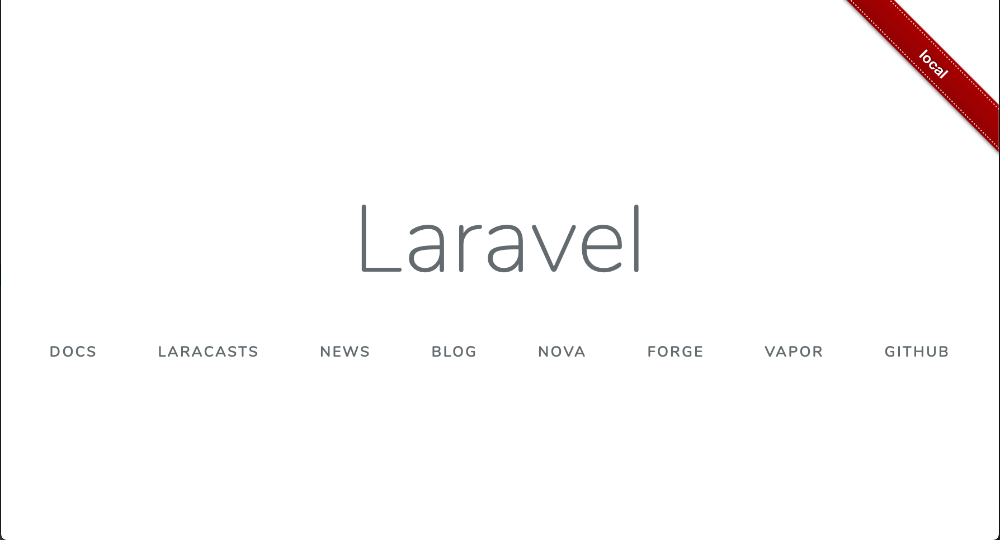

# Laravel Dev Mark

Differentiate development environment from production.

## Screenshot



## Installation

Require this package with composer. It is recommended to only require the package for development.

```
composer require --dev enomotodev/laravel-dev-mark
```

Laravel uses Package Auto-Discovery, so doesn't require you to manually add the ServiceProvider.

### Without auto-discovery

If you don't use auto-discovery, add the ServiceProvider to the providers array in config/app.php

```php
LaravelDevMark\ServiceProvider::class,
```

### Customize layout

Copy the package config to your local config with the publish command:

```
php artisan vendor:publish --provider="LaravelDevMarkServiceProvider"
```

## License

Laravel Dev Mark is open-sourced software licensed under the [MIT license](http://opensource.org/licenses/MIT)
